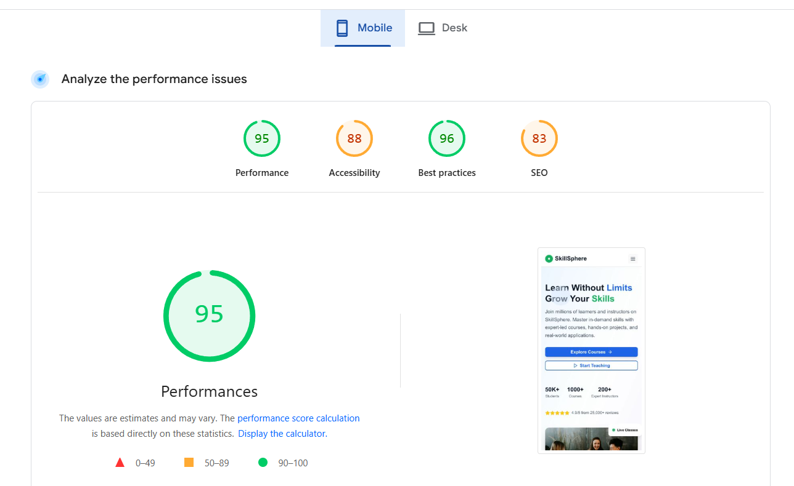
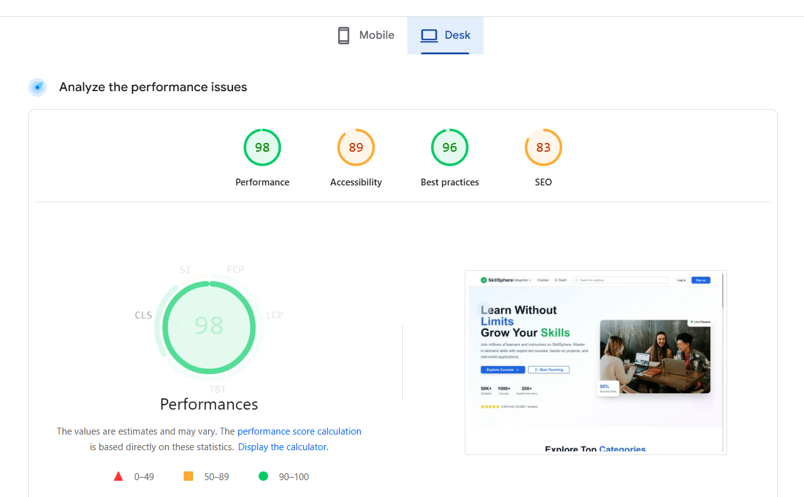

# SkillSphere - Learning Management System

A comprehensive Learning Management System built with the **MERN Stack** demonstrating enterprise-level web application development skills, modern React patterns, and scalable backend architecture.


## ⚡ Performance Metrics

<table>
<tr>
<td width="50%" align="center">

### Mobile Performance



**Score: 95/100** ✅

</td>
<td width="50%" align="center">

### Desktop Performance



**Score: 98/100** ✅

</td>
</tr>
</table>


## 🚀 Technical Highlights

**Full-Stack Architecture:**
- **Backend**: Node.js + Express.js REST API with JWT authentication
- **Frontend**: React 18 + Vite with modern hooks and Context API
- **Database**: MongoDB with Mongoose ODM
- **Deployment**: Vercel (Full-Stack deployment configuration)

**Advanced Features:**
- Role-based authentication (Students & Instructors)
- File upload with Cloudinary integration
- Payment processing with PayPal SDK
- Real-time progress tracking
- Responsive UI with Tailwind CSS + Radix UI components

## 🛠️ Technology Stack

| Frontend | Backend |
|----------|---------|
| react | express |
| react-router-dom | mongoose |
| axios | jsonwebtoken |
| framer-motion | bcryptjs |
| react-player | cloudinary |
| @radix-ui/react-* | paypal-rest-sdk |
| tailwindcss | multer |
| lucide-react | cors |

## 🔧 Architecture & Design Patterns

### Backend Architecture
- **MVC Pattern**: Organized controllers, models, and routes
- **Middleware**: Custom authentication middleware with JWT
- **Error Handling**: Global error handling middleware
- **File Upload**: Multer + Cloudinary integration
- **Database**: MongoDB with structured schemas and relationships

### Frontend Architecture
- **Component-Based**: Modular, reusable React components
- **State Management**: Context API for global state
- **Routing**: Protected routes with role-based access
- **UI Library**: Custom component system with Radix UI
- **Responsive Design**: Mobile-first approach with Tailwind CSS

## 📊 Key Features

<table>
<tr>
<td width="50%" valign="top">

### 🔐 Authentication & Authorization
- JWT-based authentication
- Role-based access control (Student/Instructor)
- Protected routes and middleware
- Secure password hashing with bcrypt

</td>
<td width="50%" valign="top">

### 👨‍🏫 Instructor Dashboard
- Course creation and management
- Video/media upload with Cloudinary
- Student enrollment tracking
- Revenue analytics

</td>
</tr>
<tr>
<td width="50%" valign="top">

### 👨‍🎓 Student Experience
- Course browsing with advanced filtering
- Video streaming with progress tracking
- PayPal payment integration
- Certificate generation
- Progress reset functionality

</td>
<td width="50%" valign="top">

### 💳 Payment Processing
- PayPal SDK integration
- Order creation and capture
- Transaction history
- Secure payment flow

</td>
</tr>
</table>

## 🚀 Quick Start

### Prerequisites
- Node.js 18+
- MongoDB Atlas account
- Cloudinary account
- PayPal Developer account

### Installation

1. **Clone the repository**
```bash
git clone https://github.com/adityapandey78/SkillShpere-LMS.git
cd SkillShpere-LMS
```

2. **Backend Setup**
```bash
cd server
npm install
# Configure your environment variables in .env file
npm run dev
```

3. **Frontend Setup**
```bash
cd client
npm install
npm run dev
```

### Environment Variables
```env
# Server (.env)
PORT=5000
MONGO_URI=your_mongodb_connection_string
JWT_SECRET=your_jwt_secret
CLIENT_URL=http://localhost:5173
CLOUDINARY_CLOUD_NAME=your_cloud_name
CLOUDINARY_API_KEY=your_api_key
CLOUDINARY_API_SECRET=your_api_secret
PAYPAL_CLIENT_ID=your_paypal_client_id
PAYPAL_CLIENT_SECRET=your_paypal_client_secret

# Client (.env)
VITE_API_URL=http://localhost:5000
```

## 📡 API Documentation

### Authentication Endpoints
```
POST   /auth/register          # User registration
POST   /auth/login             # User login
GET    /auth/check-auth        # Verify JWT token
```

### Course Management (Instructor)
```
POST   /instructor/course/add                    # Create course
GET    /instructor/course/get                    # Get instructor courses
GET    /instructor/course/get/details/:id        # Get course details
PUT    /instructor/course/update/:id             # Update course
```

### Media Management
```
POST   /media/upload           # Upload single file
POST   /media/bulk-upload      # Bulk file upload
DELETE /media/delete/:id       # Delete file
```

### Student Operations
```
GET    /student/course/get                               # Browse courses
GET    /student/course/get/details/:id                   # Course details
POST   /student/order/create                             # Create order
POST   /student/order/capture                            # Process payment
GET    /student/courses-bought/get/:studentId            # Enrolled courses
GET    /student/course-progress/get/:userId/:courseId    # Get progress
POST   /student/course-progress/mark-lecture-viewed      # Mark complete
POST   /student/course-progress/reset-progress           # Reset progress
```

## 🌐 Deployment

### Full-Stack Vercel Deployment
- Configured `vercel.json` for both frontend and backend
- Environment variable management
- Automatic deployments from Git
- Optimized build configuration for production

## 💻 Database Schema

<table>
<tr>
<td width="50%" valign="top">

### User Model
```javascript
{
  userName: String,
  userEmail: String,
  password: String, 
  role: String
}
```

</td>
<td width="50%" valign="top">

### Course Model
```javascript
{
  instructorId: String,
  instructorName: String,
  title: String,
  category: String,
  level: String,
  primaryLanguage: String,
  description: String,
  pricing: Number,
  curriculum: [LectureSchema],
  students: [StudentSchema],
  isPublised: Boolean
}
```

</td>
</tr>
</table>

## 🔍 Code Quality & Best Practices

- **ES6+ Features**: Arrow functions, destructuring, async/await
- **Component Composition**: Reusable UI components with proper prop handling
- **Error Boundaries**: Graceful error handling and user feedback
- **Performance Optimization**: Code splitting and lazy loading
- **Security**: Input validation, JWT implementation, CORS configuration
- **Responsive Design**: Mobile-first responsive layouts
- **TypeScript Ready**: Structured for easy TypeScript migration

## 🎯 Key Technical Achievements

### Backend Development
- RESTful API design with proper HTTP status codes
- JWT authentication with middleware protection
- File upload handling with Multer and Cloudinary
- Payment processing with PayPal SDK
- MongoDB integration with Mongoose ODM
- Error handling and validation

### Frontend Development
- Modern React 18 with functional components and hooks
- Context API for global state management
- Protected routing with role-based access
- Responsive design with Tailwind CSS
- Custom UI component library with Radix UI
- Video player integration with progress tracking

### DevOps & Deployment
- Full-stack Vercel deployment configuration
- Environment variable management
- Production-ready build optimization
- CORS configuration for cross-origin requests

---
